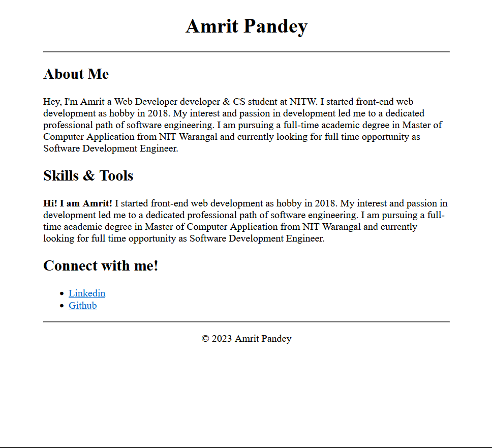

# Session 2

## Agenda

- HTML

## Session Recording

Watch the recorded session [here](https://drive.google.com/file/d/1aPodxKxPFOP6b06t4nG__Ygd4cYjqGnC/view?usp=sharing).

## Getting started

- [MDN Web Docs for HTML](https://developer.mozilla.org/en-US/docs/Learn/Getting_started_with_the_web/HTML_basics)

Let's see how basic HTML document looks like
```html
<html>
    <head>
        <!-- here goes header content -->
    </head>
    <body>
        <!-- here goes actual data needs to be displayed -->
    </body>
</html>
```

An HTML5 document looks like this:
```html
<!DOCTYPE html>
<html>
    <head>
        <!-- here goes header content -->
    </head>
    <body>
        <!-- here goes actual data needs to be displayed -->
    </body>
</html>
```

Let's begin coding HTML

### Assignment 1

Template: [Download](https://gist.github.com/amritpandey23/1c41028f83eeb0903e941b34a196341f)


Submission: [Upload Here](https://forms.gle/WW5FWTjqUxVmNM759)

### HTML Layout


