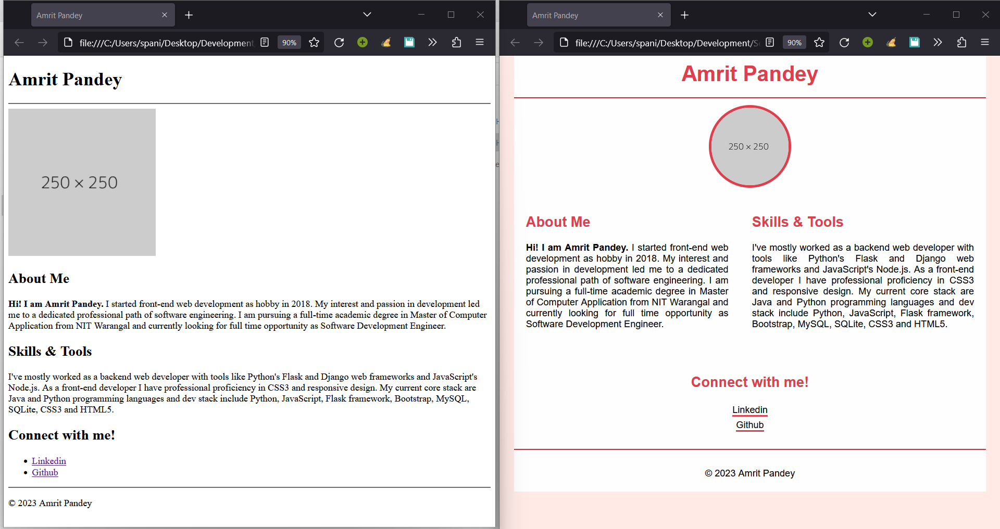
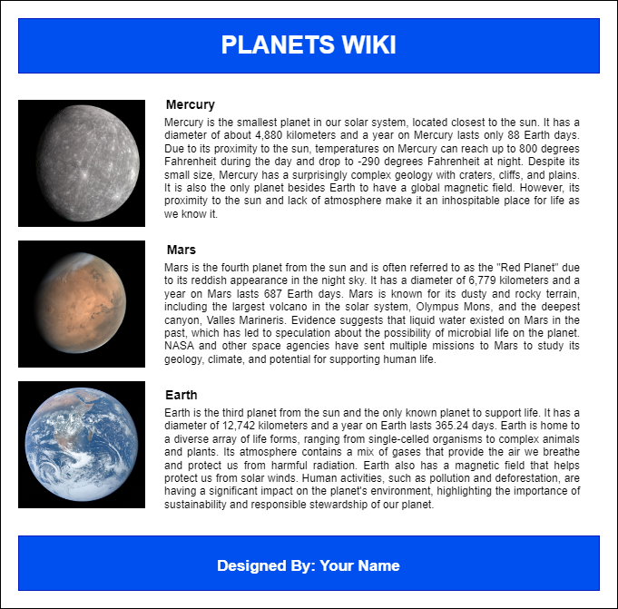

# Session 3

## Agenda

- CSS Basics: In today's session we are going to cover following topics:

1. What is CSS?
2. CSS Selectors, in-line and external files.
3. Fonts
4. Size, Width, Padding, Margin
5. Color and Border
6. Display

## Session Recording

Watch the recorded session [here](https://drive.google.com/file/d/1qfJ8AHdB1Chg6EkpLj4Ox9q71GU4K8Jd/view?usp=sharing).

## Session Workshop

In this workshop we are going to add CSS to our previous HTML Assignment 1. The results after adding the CSS to our previous assignment is given below:

Download starter files [here](https://drive.google.com/file/d/1chluh0A2qJ9KWD7bld-UDvD9GaGEInd2/view?usp=sharing).

## Assignment 2

Task: Convert the following mockup given below into a webpage.

Submission Link: [Here](https://forms.gle/Pzd5YBNCEUFcQZkq8)

