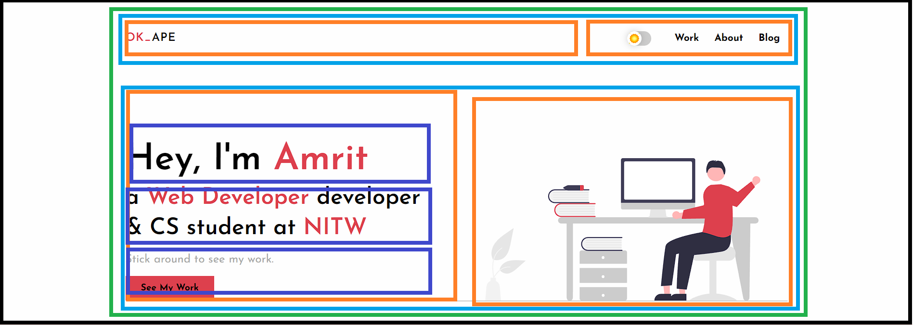
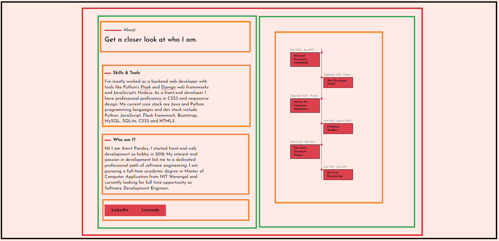

# Session 5 : Website Design -- Part 1

## Agenda

- Converting our mockup to HTML

## Session Workshop

In this session we converted [our website](https://www.okape.co.in) design mockup to HTML. We began by visualizing entire website into rectangular boxes as we did in Session 2 and started coding HTML section by section. Given below is the mockup of our page:

### Header Section:


### About Section:


### Work Section:


### Connect Section:


### Final HTML Code:

```html
<!DOCTYPE html>
<html lang="en">
	<head>
		<meta charset="UTF-8" />
		<meta http-equiv="X-UA-Compatible" content="IE=edge" />
		<meta name="viewport" content="width=device-width, initial-scale=1.0" />
		<title>Amrit Pandey</title>
		<link rel="stylesheet" href="main.css" />
	</head>
	<body>
		<!-- first section -->
		<div class="header">
			<div class="main-navbar">
				<div class="brand">OK_APE</div>
				<div class="navbar">
					<ul>
						<li>Button</li>
						<li>Work</li>
						<li>About</li>
						<li>Blog</li>
					</ul>
				</div>
			</div>
			<div class="header-hero">
				<div class="hero-description">
					<p>Hey, I'm Amrit</p>
					<p>a Web Developer & CS Student</p>
					<div>
						<p>Stick around to see my work</p>
						<button>See my Work</button>
					</div>
				</div>
				<div class="hero-img">
					
				</div>
			</div>
		</div>

		<!-- second section -->
		<div class="about">
			<div class="about-description">
				<div class="about-description-title">
					<small>About</small>
					<h2>Get a closer look at who I am.</h2>
				</div>
				<div class="about-skills">
					<small>Skills & Tools</small>
					<p>
						I've mostly worked as a backend web developer with tools
						like Python's Flask and Django web frameworks and
						JavaScript's Node.js. As a front-end developer I have
						professional proficiency in CSS3 and responsive design.
						My current core stack are Java and Python programming
						languages and dev stack include Python, JavaScript,
						Flask framework, Bootstrap, MySQL, SQLite, CSS3 and
						HTML5.
					</p>
				</div>
				<div class="about-who-i-am">
					<small>Who am I?</small>
					<p>
						Hi! I am Amrit Pandey. I started front-end web
						development as hobby in 2018. My interest and passion in
						development led me to a dedicated professional path of
						software engineering. I am pursuing a full-time academic
						degree in Master of Computer Application from NIT
						Warangal and currently looking for full time opportunity
						as Software Development Engineer.
					</p>
				</div>
				<div class="about-social-links">
					<button>Linkedin</button>
					<button>Leetcode</button>
				</div>
			</div>
			<div class="about-timeline">
				<!-- TODO: Timeline design -->
			</div>
		</div>

		<!-- work section -->
		<div class="work">
			<div class="work-title">
				<small>Work</small>
				<h2>A Summary of my work did in past</h2>
			</div>
			<div class="work-content">
				<div class="work-content-project">
					<small>Projects</small>
					<div class="work-slide-show">
						<!-- TODO: build the slide show -->
					</div>
				</div>
				<div class="work-content-articles">
					<small>Articles</small>
					<ul class="article-list">
						<li>[JavaScript] Why do we need tests?</li>
						<li>
							What Go Programming Language does and does not have
						</li>
						<li>Some invaluable tips for programmers.</li>
						<li>The Minimalist Terminal Setup</li>
						<li>
							“Linux” is not the name of Operating System you know
							of!
						</li>
					</ul>
				</div>
			</div>
		</div>

		<!-- connect section -->
		<div class="connect">
			<div class="connect-title">
				<small>Connect</small>
				<h2>Interested in working with me?</h2>
			</div>
			<div class="connect-social-links">
				<small>Social Handles</small>
				<p>
					<a href="https://google.com" target="_blank">Linkedin</a>
					<a href="#">Github</a>
				</p>
			</div>
			<div class="connect-email">
				<small>Email</small>
				<p>
					For queries regarding project, FTE offers and work send me
					an email to
					<a href="mailto:mail.amritpandey@gmail.com"
						>mail.amritpandey@gmail.com.</a
					>
				</p>
			</div>
			<div class="footer">&copy; Amrit Pandey 2023</div>
		</div>
	</body>
</html>

```
